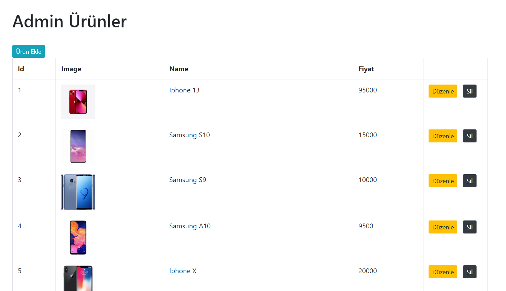
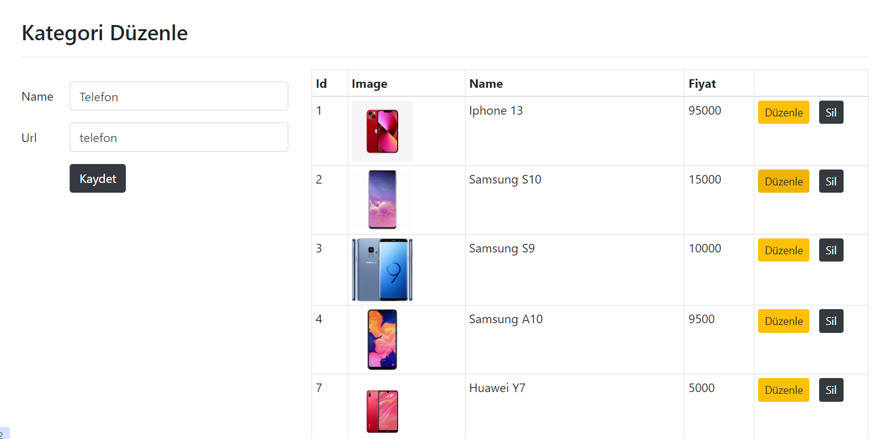
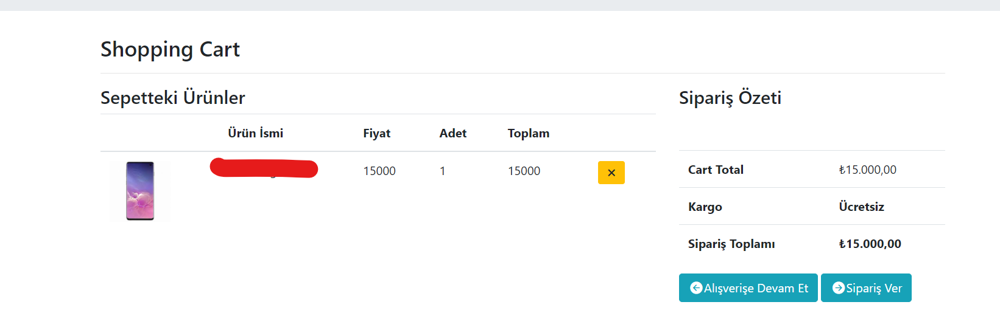

# e-commerce-site-ASP.NET-CORE-MVC
<table>
    <tr>
      <td>
                  
      </td>
      <td>
          
      </td>
    </tr>
     
    <tr>
      <td>
                  
      </td>
      <td>
          
      </td>
    </tr>
    <tr>
      <td>
                  
      </td>
      <td>
          
      </td>
    </tr>
    <tr>
      <td>
                  
      </td>
      <td>
          
      </td>
    </tr>
    <tr>
      <td>
                  
      </td>
      <td>
          
      </td>
    </tr>
    <tr>
      <td>
                  
      </td>
      <td>
          
      </td>
    </tr>
    <tr>
      <td>
                  
      </td>
      <td>
          
      </td>
    </tr>
    <tr>
      <td>
                  
      </td>
      <td>
          
      </td>
    </tr>
</table>
